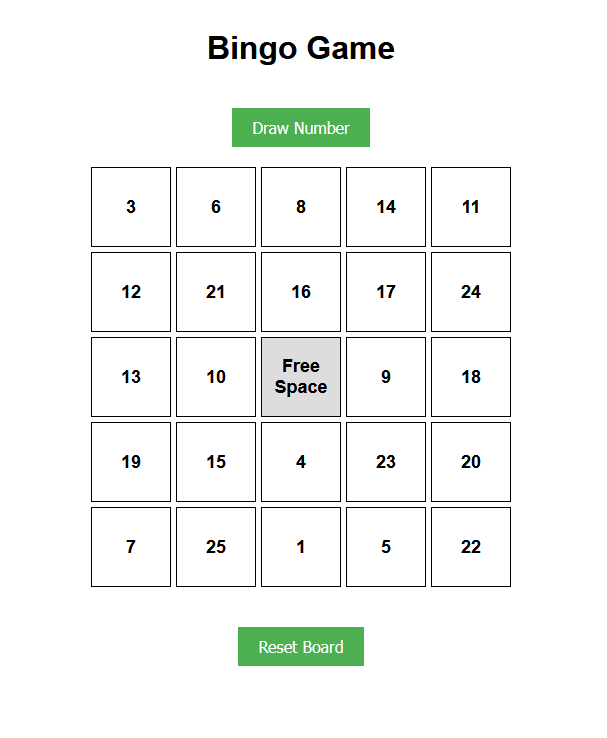
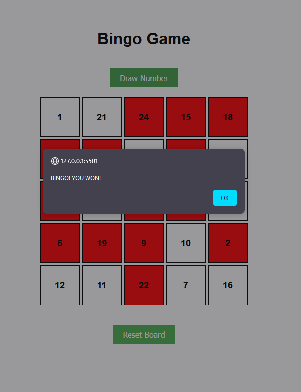
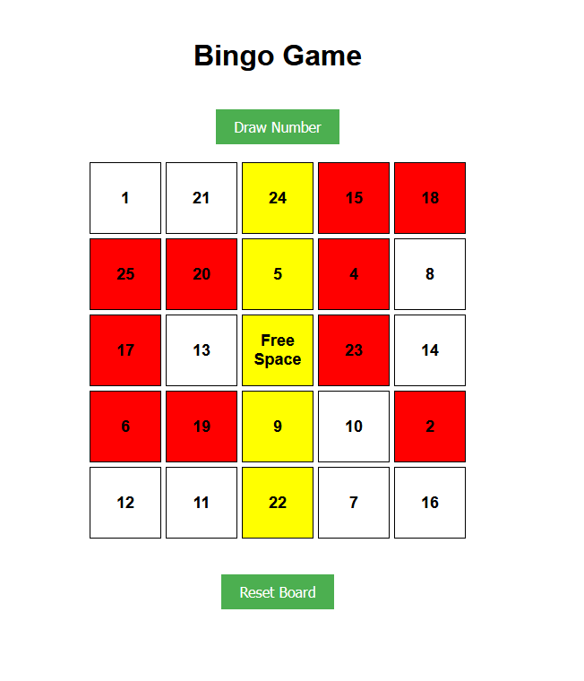

# Bingo Game

A basic bingo game built using Javascript, HTML, and CSS. The app enables users to use a random generated board and bingo numbers to win 5 in a row for BINGO! right in their web browser.

## Description

-Users start off with a randomly generated 5 X 5 bingo board, with a "Free Space" in the middle.

-A random bingo number is generated when clicking the "Draw Number" button. If the number drawn corresponds with a number on the board, the square on the board is highlighted red.

-Users can use the "Draw Number" board repeatedly, filling the squares until 5 in a row horizontally, vertically, or diagonally is achieved.

-When 5 in a row (BINGO) is achieved, an alert prompts the user that they have won bingo. Closing the window notifys the user of the winning row, by highlighting the row in yellow.

-Users can play again by using the "Reset Board" button.

## Technologies Used
-HTML

-CSS

-Javascript

## How To Interact

-Clone this repository

-Open the HTML file in your browser

-Start calculating

# Enjoy playing BINGO! 

## Javascript Concepts Used
String Methods Used:

    length

Array Methods Used:

    push()
    includes()
    concat()
    some()
    every()
    splice()